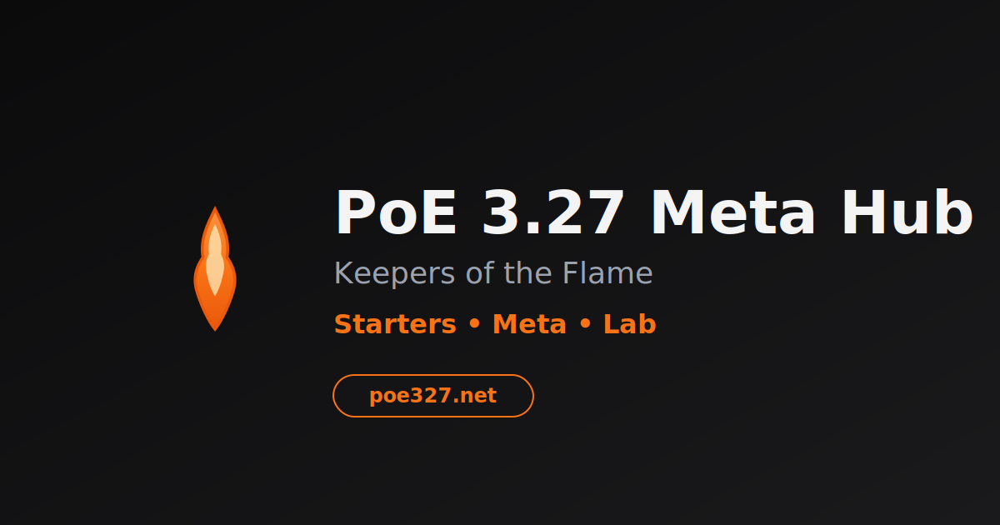
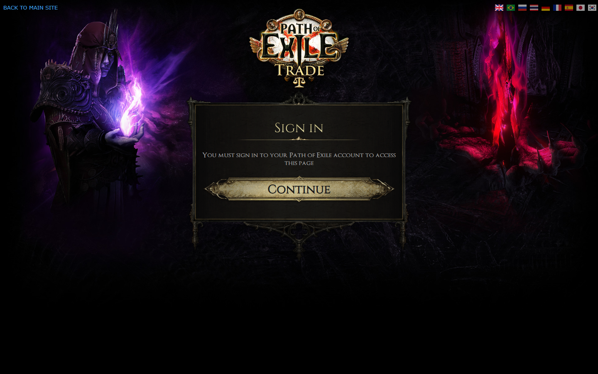

<p align="center">
  
</p>

# poe327.net – PoE 3.27 Hub

A focused Path of Exile 3.27 website with quick-access tools and references. This site only targets 3.27, so routes and copy are short and version-free.

## Live Routes

- Filters: `/filters`
- Neversink Filters: `/filters/neversink`
- Awakened Trade: `/trade/awakened`
- Official Trade: `/trade/official`
- Syndicate Cheat Sheet: `/betrayal-cheatsheet`
- Patch Notes Library: `/patch-notes`

Legacy 3.27-styled routes (e.g. `/poe-3-27-loot-filter`) 301-redirect to the short paths above. See `next.config.ts`.

## Preview

<p>
  
</p>

<p>
  
</p>

## Quick Start

```bash
npm i
npm run dev    # http://localhost:3000
npm run build  # production build
npm run start  # serve production build
```

## Project Structure (App Router)

```text
app/
  page.tsx                 # Home
  filters/
    page.tsx               # Loot Filter Lab
    neversink/
      page.tsx             # Neversink Filters
  trade/
    awakened/page.tsx      # Awakened Trade guide
    official/page.tsx      # Official Trade guide
  betrayal-cheatsheet/
    page.tsx               # Syndicate cheat sheet
  patch-notes/
    page.tsx               # Patch notes library
components/
  site-header.tsx          # Navigation (Starter/Builds removed)
  ...
public/
  images/                  # Artwork & screenshots
  cheatsheet/              # Cheat sheet sprite slices
```

## Navigation & URLs

- Minimal, 3.27-only IA. No `/starter` or `/builds` sections.
- Filters moved to the plural root: `/filters`.
- Trade tools live under `/trade/*`.
- Canonicals updated on all pages to match short routes.
- Static `public/sitemap.xml` updated accordingly.

## SEO Notes

- Each page exports `metadata` with an updated `alternates.canonical`.
- Open Graph and Twitter cards use the site’s OG image (`/og-image.svg`).
- `metadataBase` can be added for consistent absolute URLs if needed.

## Scripts

- `npm run dev` – Start dev server
- `npm run build` – Production build (Turbopack)
- `npm run start` – Run the production build

## License

For personal/league use. Not affiliated with Grinding Gear Games.
